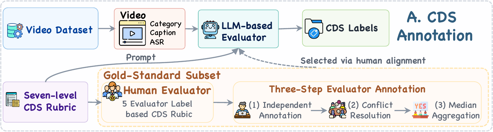
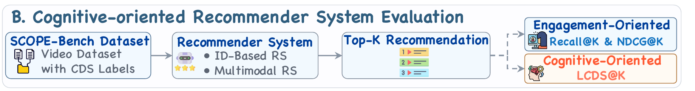

# SCOPE-Bench: Content Depth Matters in Short Videos

[](https://opensource.org/licenses/MIT)
[](https://www.python.org/downloads/release/python-3100/)
[](https://pytorch.org/get-started/locally/)

Official PyTorch implementation for **Content Depth Matters in Short Videos: Rethinking the Attention Economy**.

## 🎯 Overview

**SCOPE-Bench** (**S**hort-video **CO**ntent de**P**th **E**valuation Benchmark) measures short-video content depth from two complementary perspectives:

- **Item level:** **Content Depth Score (CDS)** measures how deeply a video presents and develops information using a seven-level rubric.
- **Recommendation-list level:** **List-wise Content Depth Score (LCDS)** measures the content depth of a top-k recommendation list, supporting cognitive-aware recommender-system evaluation beyond engagement alone.

CDS captures informational and reasoning depth; it does not assess factual correctness, safety, or other independent dimensions of content quality.

<p align="center">
  
</p>
<p align="center"><em>(a) Item-level CDS annotation workflow.</em></p>

<p align="center">
  
</p>
<p align="center"><em>(b) Recommendation-list-level cognitive-aware evaluation workflow.</em></p>

A single experiment reports:

- engagement-oriented metrics: **Recall**, **NDCG**, and **Precision**;
- content-depth metrics: **A-LCDS** and **E-LCDS**.

All metrics share the same top-k settings (`[10, 20, 50]` by default). The repository includes data preparation, Qwen scoring, model training, hyperparameter search, and unified evaluation.

## 📊 Benchmark

SCOPE-Bench extends the open-source ShortVideo dataset with CDS annotations for its 150K videos. The source datasets reported in the paper contain:

| Dataset           | Users | Items   | Interactions |
| ----------------- | ----- | ------- | ------------ |
| ShortVideoSampled | 6,654 | 31,496  | 128,105      |
| ShortVideoFull    | 10,000 | 153,561 | 1,007,746    |

The downloadable training bundles apply click-positive filtering and retain users with at least four positive interactions; their post-filter statistics and split details are documented in [datasets/README.md](datasets/README.md).

The primary benchmark contains 14 baselines: **BPR, LightGCN, NCF, FlowCF, VBPR, BM3, DiffMM, GRCN, REARM, FREEDOM, MGCN, LGMRec, LATTICE,** and **FITMM**.

## 📂 Project Structure

```text
SCOPE-Bench/
├── configs/                # Dataset and model configurations
├── core/                   # Training, evaluation, HPO, and metrics
├── datasets/               # Prepared benchmark datasets
├── models/                 # Recommendation models
├── scoring/                # Qwen CDS scoring pipeline
├── scripts/                # Data preparation and validation tools
├── main.py                 # Single-model entry point
└── run_scope_baselines.sh  # Primary benchmark launcher
```


## 📝 Installation

```bash
git clone <SCOPE_BENCH_REPOSITORY_URL>
cd SCOPE-Bench

python -m venv .venv
source .venv/bin/activate

# Install the PyTorch build appropriate for your CUDA environment first.
pip install torch torchvision
pip install -e ".[torch,multimodal,scoring,hpo]"
```


## 👉 Data Preparation

Download the benchmark artifacts and source dataset from:

- Prepared benchmark data: [Google Drive](https://drive.google.com/drive/folders/101pyI9ulBXXYL1lt8quBOXaDumcu3Hpw?usp=drive_link)
- Original WWW2025 ShortVideo dataset: [tsinghua-fib-lab/ShortVideo_dataset](https://github.com/tsinghua-fib-lab/ShortVideo_dataset)
- Full Qwen CDS scores: [Google Drive](https://drive.google.com/drive/folders/101pyI9ulBXXYL1lt8quBOXaDumcu3Hpw?usp=drive_link)

> [!IMPORTANT]
> SCOPE-Bench is built upon the WWW2025 ShortVideo dataset, but the original release contains data-alignment inconsistencies. For reliable reproduction, we recommend using the corrected and prepared benchmark data provided by SCOPE-Bench instead of directly using the original files. The identified issues and our repair procedure are documented in [docs/dataset_repair.md](docs/dataset_repair.md).

Place the downloaded artifacts at:

```text
datasets/ShortVideoSampled/
datasets/ShortVideoFull/
scoring/results/Qwen3_7_Max_CDS_scores.jsonl
```

Validate the dataset before training:

```bash
python scripts/validate_short_video_bundle.py --datasets ShortVideoSampled
```

Dataset contents and the original data-alignment repair are described in [datasets/README.md](datasets/README.md) and [docs/dataset_repair.md](docs/dataset_repair.md).

## 🚀 Quick Start

Train and evaluate one model:

```bash
python main.py \
  --model LightGCN \
  --dataset ShortVideoSampled \
  --max_epochs 500 \
  --gpu_id 0
```

Run all primary baselines:

```bash
GPU=0 bash run_scope_baselines.sh
```

Or run a selected subset:

```bash
MODELS="BPR LightGCN NCF VBPR BM3" EPOCHS=100 GPU=0 \
bash run_scope_baselines.sh
```

Each run writes `Recall@K`, `NDCG@K`, `Precision@K`, `A-LCDS@K`, and `E-LCDS@K` to the same logs and result files under:

```text
outputs/results/<MODEL>/<DATASET>/<TYPE>/
```

For advanced usage, see [model details](docs/models.md), [configuration](docs/Tutorial/02-configuration.md), [hyperparameter optimization](docs/Tutorial/04-hpo.md), [LCDS evaluation](docs/Tutorial/08-lcds.md), and the [Qwen scoring guide](scoring/README.md).

## 🤝 Acknowledgements

SCOPE-Bench is built upon the original [WWW2025 ShortVideo dataset](https://github.com/tsinghua-fib-lab/ShortVideo_dataset). Its implementation also draws upon and takes inspiration from [MMRec](https://github.com/enoche/MMRec), [RecBole](https://github.com/RUCAIBox/RecBole), [Tenrec](https://github.com/yuangh-x/2022-NIPS-Tenrec), and [FedVLR](https://github.com/mtics/FedVLR). We sincerely thank their authors and contributors for making these valuable resources publicly available.

## 🌟 Citation

If you find SCOPE-Bench useful, please cite our work:

The official BibTeX entry is **coming soon**.


## 📄 License

The code is released under the [MIT License](LICENSE). Dataset and model artifacts remain subject to their original licenses and terms.
